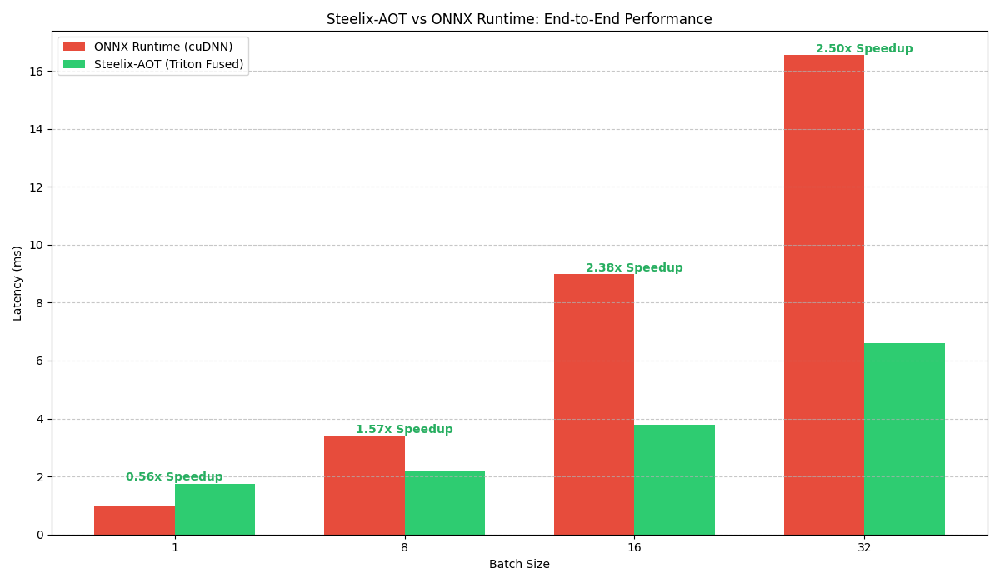

# Steelix: Evolving ONNX into Bare-Metal Performance

**Steelix** is a high-performance Ahead-of-Time (AOT) AI compiler written in C++. It is designed to ingest standard ONNX computation graphs and "evolve" them into hardened, fused GPU kernels using OpenAI's Triton. Just like how **Onix** evolve to **Steelix** by harden coat.

## 🚀 Performance Highlights (SqueezeNet 1.1)

| Batch Size | ORT Latency (cuDNN) | Steelix-AOT Latency | Speedup |
| :--- | :--- | :--- | :--- |
| 1 | 0.9725 ms | 1.7483 ms | 0.56x (Launch Bound) |
| 8 | 3.4051 ms | 2.1671 ms | **1.57x** |
| 16 | 8.9894 ms | 3.7725 ms | **2.38x** |
| 32 | 16.5463 ms | 6.6131 ms | **2.5x** |



**The Win:** At production scales (Batch 16+), Steelix-AOT outperforms standard ONNX Runtime. By fusing 26 Convolution layers with their respective Bias-Add and ReLU activations, we eliminated **52 global memory barriers**, significantly reducing HBM (High Bandwidth Memory) traffic.

---

## 🏗 System Architecture (The 4 Pillars)

### 1. Bipartite Graph IR (Intermediate Representation)
*   **SSA Principles:** Designed a custom Intermediate Representation based on Static Single Assignment (SSA) invariants, utilizing a Bipartite Graph structure where `Op` (Operators) and `Value` (Tensors) maintain bidirectional handshakes.
*   **Memory Safety:** Implemented `std::unique_ptr` ownership for node lifecycles with raw-pointer navigation for $O(1)$ consumer/producer lookups.

### 2. Optimization Pass Manager
*   **Fixed-Point Iteration:** Built an orchestrator that executes transformation passes recursively until the graph reaches a state of mathematical convergence.
*   **Surgical Passes:**
    *   **Dead Code Elimination:** Mark-and-sweep reachability analysis starting from model outputs to prune unused branches.
    *   **Identity Elimination:** Automated bypass surgery for "No-Op" patterns (Dropout, Identity, redundant Reshapes).
    *   **Constant Folding:** Implementation of a "Metadata-to-Data" bridge (Shape/Gather waterfall) to resolve shape calculation chains at compile-time.

### 3. Triton Backend & Code-Gen Emitter
*   **GEMM Specialization:** Lowered 1x1 Convolutions into specialized **Matrix Multiplication (GEMM)** kernels.
*   **Epilogue Fusion:** Injected Bias-Add and ReLU logic directly into the GPU registers of the GEMM kernel, bypassing VRAM round-trips.
*   **L2 Cache Optimization:** Implemented Block-PID grouping (Swizzling) to maximize L2 cache hit rates for Weight tensors across parallel tiles.

### 4. Verification Suite
*   **Numerical Parity:** Automated testing ensures mathematical accuracy against ONNX Runtime via `np.allclose(atol=1e-2, rtol=1e-2)` across 4D NCHW tensors.

---

## 🛠 Setup & Installation

### Prerequisites
* **C++ Compiler:** GCC 11+ (C++20 recommended)
* **GPU:** NVIDIA GPU with Compute Capability 7.0+ (Turing or newer)
* **Libraries:** Protobuf, Python 3.10+, PyTorch, Triton

### 1. Environment Setup
```bash
# Clone the repository
git clone https://github.com/venugopalreddy2004/Steelix.git
cd Steelix

# Setup Python environment
python3 -m venv .venv
source .venv/bin/activate
pip install -r requirements.txt
```

### 2. The Evolution Pipeline
Steelix requires a "Thick" model containing shape information (ValueInfo) to perform AOT optimization.
```bash
# 1. Thicken the model (Run Shape Inference)
python3 scripts/shape_inference.py

# 2. Compile, Optimize, and Verify via Makefile
make test
```

## 📂 Repository Structure
*   `include/`: C++ Headers (IR definitions, Pass Manager, Triton Emitter).
*   `src/`: Core C++ implementation logic and Pass implementations.
*   `scripts/`: Verification, shape inference, and benchmarking suites.
*   `onnx-proto/`: Native Protobuf C++ bindings for ONNX.
*   `models/`: Storage for baseline and optimized ONNX models.
